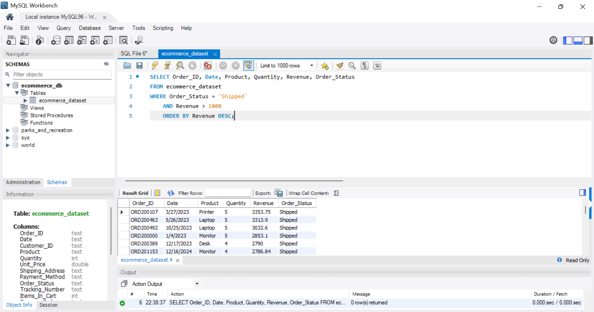
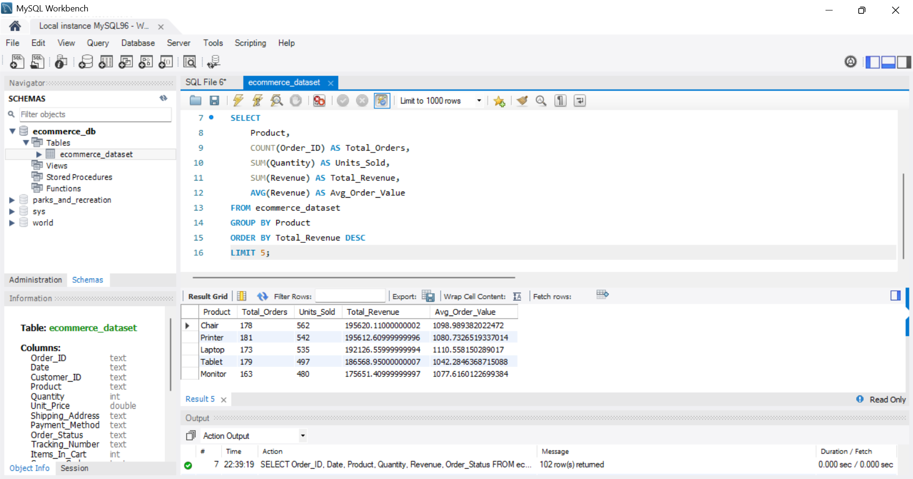
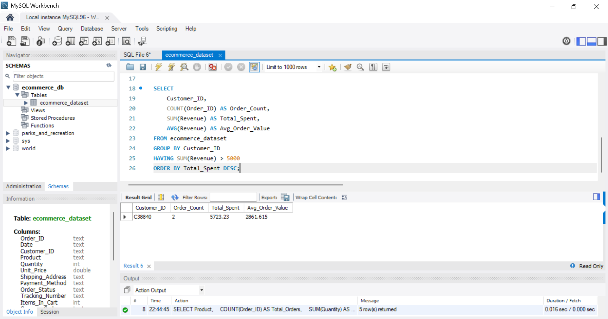
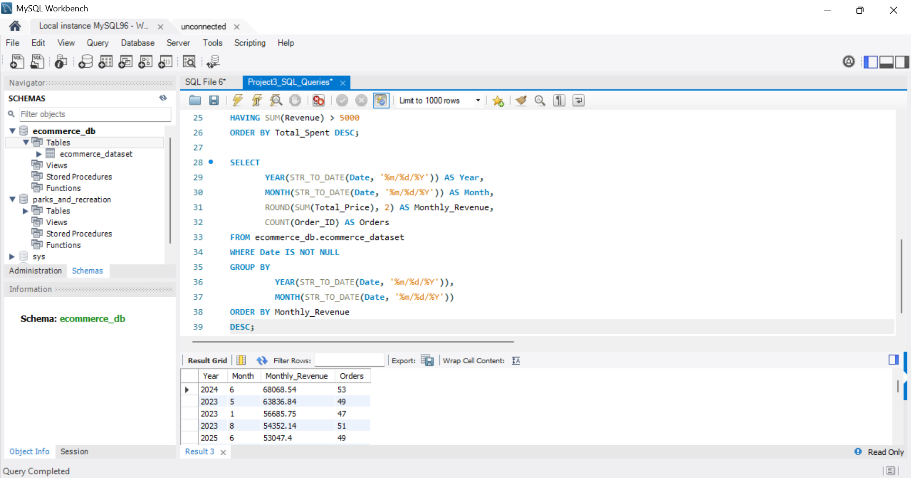

# Task-3-Alaezi-Emmanuel - SQL Ecommerce Analysis

**Skills demonstrated:** WHERE, ORDER BY, GROUP BY, SUM, COUNT, AVG, STR_TO_DATE

**Dataset:** Ecomemrce sales date with Order_ID, Customer_ID, Product, Date, Revenue

**Key Insights:**
**Top revenue order:** N68,068.54 from Order_ID ORD200789 - highest single transaction
**Best Product:** Chair generated N195,620 total revenue
**Repeat customers:** 1 customer placed multiple orders
 **Peak month:** June 2024 with N68,068.54 revenue from 53 orders

 **Tools:** MySQL Workbench

### Screenshots of Query Results

*Query 1: Top 5 Highest Revenue Orders*

*Query 2: Revenue by Product* 

*Query 3: Repeat Customers*

*Query 4: Monthly Revenue Trend*

